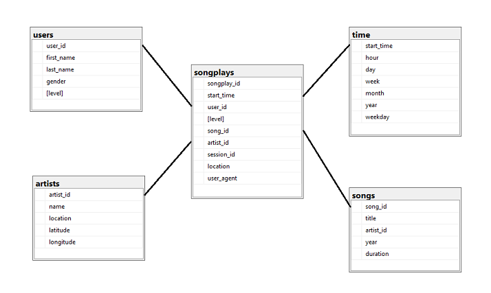

# Data Modeling with PostgreSQL Project 1
# Creating a Database Schema and ETL Pipeline for Sparkify
### Data Engineer: Matthew Prout

 

## Purpose of this Database
The Sparkify company would like to be able to gather insights from the song and log datasets that are generated from their customer’s activity. In order to generate the insights, the data must be loaded from JSON files in folders into a PostgreSQL database.

## Raw Data
The song and log data are both JSON files stored in the following folders:

| Folder | Partitioning | Example |
| - | - | - |
| Log Data | By year/month | data/log_data/2018/11 |
| Song Data | By first three letters of song | data/song_data/A/A/A |

## Database Design

The database employs a star topology for online analytical processing (OLAP) by the analytics team. This design is suited for performing complex queries that use aggregations and the need for denormalization for performance. In this use case, logs are being ingested and there is little need to update the data after it has been inserted. Therefore the database design can be optimized for reads.

**Fact table:**  
The `songplays` table is the fact table. This table is a representation of all the log data that was imported. Dimension tables have been crated for the three main entities (users, songs, and artists), and foreign keys have been added to the `songplays` table to join to these other tables. Another dimension table was added for the start time. This field is a denormalization of the start time and allows for faster aggregation based on attributes of the date, such as day, month, and year.

**Dimension tables:**  
The `users` table contains essential fields for the user such as first and last name, and it also includes the subscrption 'level', which can be useful for analytical purposes to determine product usage based on subscription level.  
The `artists` table is a dimension table for artists. It contains the artist name, and also location information of the artist.  
The `songs` table contains basic information for songs such as the song title and artist name.  
The `time` table is a dimension table that is a denormalization of the start time field. It provides a breakdown of the timestamp into hour, day, week, month, year, and weekday. This denormalization will make queries based on these other time / date attributes easier and faster.  

## Example Queries

The business may be interested in knowing what the most frequently played song is by the users. The following query can be run to find out this information:

`SELECT songs.title, artists.name
FROM songs
JOIN
  (SELECT song_id, artist_id, COUNT(song_id) AS songcount
   FROM songplays
   GROUP BY song_id, artist_id
   ORDER BY songcount DESC
   LIMIT 1) T
ON songs.song_id = T.song_id
JOIN artists
ON artists.artist_id = T.artist_id;`

This finds the highest played song, and then joins the songs and artists table to this result to get the song name and artist name.

## Running the code
1. **Create the database:** First the database needs to be created. This is done by running: `python3 create_tables.py`
2. **Perform ETL:** Next the ETL pipeline is run: `python3 etl.py`

## Files:
| File | Purpose |
| - | - |
| `create_tables.py` | A utility script to recreate the tables that make up the ETL database. The tables are first deleted (if they exist) and then they are created.|
| `etl.ipynb` | A notebook which is used to test the various ETL steps, starting with reading the data from JSON files into Pandas dataframes, munging the data, and then iterating over the dataframes to load the data into tables by calling SQL queries written in sql_queries.py. |
| `etl.py` | This script contains the production code to process the song and log files and insert the data into database tables. |
| `sql_queries.py` | Defines the queries to drop the tables, create the tables, insert records into the table, and a helper query used to get the ‘song id’ and ‘artist id’ from the songs and artists tables. |
| `test.ipynb` | A notebook that queries the tables in our database to show the current contents for debugging purposes. |

